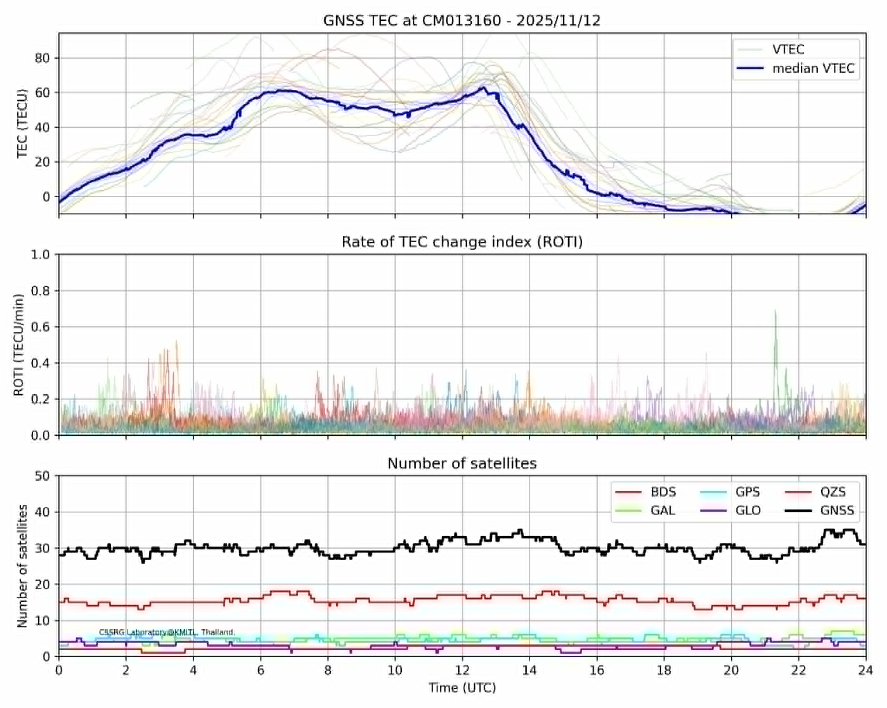

# :eyes:  Getting Started
-- If you want to work on the terminal or Visual Studio 
```bash id="c0v2r9"
git clone https://github.com/Tatphicha/TEC_CMU.git
cd TEC_CMU
```
:exclamation: Please work on **dev** branch :exclamation:

-- To makes changes: switches to dev branch
```bash id="c0v2r9"
git checkout dev
```
-- To upload to github
```bash id="c0v2r9"
git add .
git commit -m "update feature"
git push
```

# :zap: TEC_CMU
:triangular_flag_on_post: This example only runs one file for now—please wait for an update. :zzz: :sleeping::sleeping:

Here are the steps to read TEC data from MATLAB:

1. main program is "main_teccal_30.m" to get file.mat💡


👉 change outname (ex "CM013160"), stations, and p_path as your directory the you will get matfile in **Results** folder.

:boom::boom:  Don’t forget to change -- **p_path** -- to your work directory. :boom::boom:
  
👉 To test the program, please download the RINEX file from https://drive.google.com/drive/folders/13-18mmAL4U4alot1mx9xbqvDfGlgyGbc?usp=sharing to folder RINEX


2. "Run **mat2dataframe.p**y in the Python folder to get file.csv. [-- MATLAB (**convertmat2csv.m**) also works!)]"
3. plot data from csv (an example plot for CM013160 from P'Jumbo) :point_down::point_down:
## 



## 📜 License

© 2026 CM01 | Tatpicha n JumboAekawit
